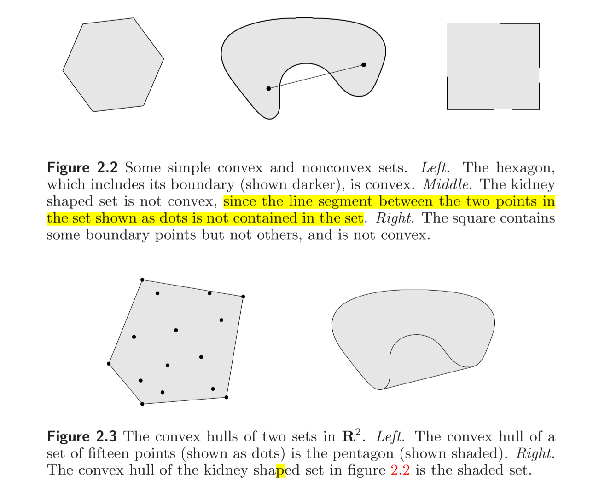

#! https://zhuanlan.zhihu.com/p/586162776
# [凸优化笔记01] Convex Set
## 1.1 Affine set
+ 直线定义：$y=\theta x_{1} + (1 - \theta) x_{2}, \theta \in R, x_{1} \neq x_{2}, $
+ 线段定义：$y=\theta x_{1} + (1 - \theta) x_{2}, \theta \in [0, 1]$

**仿射集（affine set）**：

定义：如果一个集合$C$中任两点的连线仍在集合$C$中，则称该集合为仿射集。

>Note：直线、线性方程组的解、一个点是仿射集，线段不是。

**放射组合（affine combination）**

定义：
$x_{1},x_{2},...,x_{k} \in C, \theta_{1},\theta_{2},...,\theta_{k}\in C,\sum_{i=1}^{k}\theta_{i}=1 , 则将\theta_{1}x_{1}+\theta_{2}x_{2}+...\theta_{k}x_{k}称之为仿射组合
$

>Note：如果集合$C$是仿射集，那么它的仿射组合也是属于$C$。

由于直线一定是仿射集，我们观察到其$x_{1}$和$x_{2}$的系数必须满足和为1，那么有没有一种仿射集，它的系数和不为1的呢？

考虑过原点的特殊直线形式。它一定是仿射集。而过原点的直线可看作是已知直线的平移，平移距离为$x_{0}$，$x_{0} \in C$。将该过原点的集合称为仿射集$C$的子空间$V=C-x_{0}$。

那么，如何构建一个仿射集呢？

可以这样考虑：任两点的连线是这两点的仿射组合，而仿射集要求一个集合内的任两点连线都在集合内。也即是说，如果要将一个非仿射集变成一个仿射集，在此集合上，加上集合内所有点的仿射组合就可以了。

**仿射包(affine hull)**

仿射包$\bold{aff}\ C$定义如下：
$$
\bold{aff}\ C = \{ \theta_{1}x_{1}+\theta_{2}x_{2}+...+\theta_{k}x_{k} \ |\ x_{1},...,x_{k}\in C, \theta_{1}+\theta_{2}+...+\theta_{k}=1 \}
$$

## 1.2 Convex set

定义：如果集合$C$中任两点的线段也属于集合$C$中，则称$C$是凸集(convex set)

$$\forall x_1,x_2\in C , \forall \theta \in [0,1]:$$
$$\theta x_1+(1-\theta) x_2 \in C$$

这是一个充要条件。

书上有两个图很直观，如下：

凸组合(convex combination): $\theta_1 x_1+\theta_2 x_2 + \cdots + \theta_k x_k$, and $\theta_1 + \cdots +\theta_k = 1, \theta_i \geq 0, i=1,..,k$.

凸包(convex hull)：$$ \textbf{conv}\ C = \left\{ \theta_{1}x_{1}+ \cdots + \theta_{k}x_{k}|x_{i}\in C, \theta_{i}\geq 0,i=1,…,k,\ \theta_{1}+ \cdots + \theta_{k}=1\right\} $$

包含集合C的最小凸集就是凸包$\textbf{conv}\ C$

## 1.3 Cones

锥不一定是凸集。

Cone的定义(过原点的直线)：$\forall x \in C, \theta \geq 0, \theta \ x \in C$

Convex Cone: $\forall x_1, x_2 \in C, \theta_1, \theta_2 \in C,$ and have $\theta_1 x_1 + \theta_2 x_2 \in C$

如下图：

凸锥包(conic hull)

$$ \left\{ \theta_{1}x_{1}+ \cdots + \theta_{k}x_{k}|x_{i}\in C, \theta_{i}\geq 0,i=1, \ldots ,k \right\} $$

凸锥包如下图：

凸锥包是包含集合C的最小凸锥

小结
| name | defination | condition|
| :----| :--- | :--- |
| affine combination | $\theta_1 x_1 + \theta_k x_k + \cdots + \theta_k x_k \ \text{and}\ \theta_1 + \theta_2 + \cdots + \theta_k=1$ | $\theta\in R$ |
| convex combination | the same as the above | $\theta \in [0,1]$
| conic combination | $\theta_1 x_1 + \theta_k x_k + \cdots + \theta_k x_k$ | $\theta \geq 0$ 

# 2. Examples

一些常见的凸组合：

+ 空集是仿射集、凸集
+ 任意直线是仿射集
+ 射线是凸集但不是仿射集合
+ 全空间$\mathbb{R}^n$是凸集
+ 线段是凸集

## 2.1 Hyperplanes and halfspaces
假如$n$等于2，那么超平面就是一条直线，$b$ 决定直线的偏移量,当$n$等于3的话，就是一个面。

$\{x | a^Tx = b\}\ x, a, \in R^n, b\in R, a \neq 0$

半空间：即当$a^Tx \geq b$的半个平面

## 2.2 Euclidean balls and ellipsoids

## 2.3 Polyhedra
多面体：半空间和超平面的交集

单纯形(Simplex)：空间中的k个点$v_0,v_1,v_2,v_3,\cdots,v_k$，满足$v_1-v_0, v_2-v_0, \cdots v_k - v_0$ 线性无关。

单纯形是多面体的一种

## 2.4 The positive semidefinite cone
对称半正定矩阵集合是凸锥。

对称矩阵也是凸锥。

对称正定矩阵不是。

# 3. Operations that perserve convexity

保凸运算（凸集经过以下运算后仍然是凸集）

## 3.1 Intersection
交集一定是凸集。

## 3.2 Affine function
仿射变换

若$S$为$R^n$的convex，$f:R^n\rightarrow R^m$ 是仿射，则$f(S)=\{f(x) | x \in S \}$是凸集。

## 3.3 Scale and Displacement
缩放：将集合中每个元素乘上一个系数

位移：将集合中每个元素加上一个数

## 3.4 Perspective function
透视函数$P$

$dom\ P = R^n \times R_{++}$， 其中$R_{++}$是正定空间, $P:R^{n+1}\rightarrow R^{n}$

$P(z,t)=\frac{z}{t}, z\in R^n, t \in R_{++}$

线段经过透视以后还是线段

## 3.5 Linear-fractional and perspective functions
线性分式函数（**非线性函数**）

先经过仿射变换，然后经过透视函数

令$g:R^{n}\rightarrow R^{m+1}$为仿射映射

$g(x) = [A,c^T]^T + [b, d] ^T,\ A\in R^{m\times n}, b\in R^{m}, c\in R^{1\times n}, d\in R$

P为透视映射，即$P:R^{m+1}\rightarrow R^{m}$，则：

$f(x)=\frac{Ax+b}{c^{T}x+d}, dom\ f=\{ x| c^Tx+d >0 \}$

举例：两个随机变量的联合概率映射到条件概率是保凸映射。