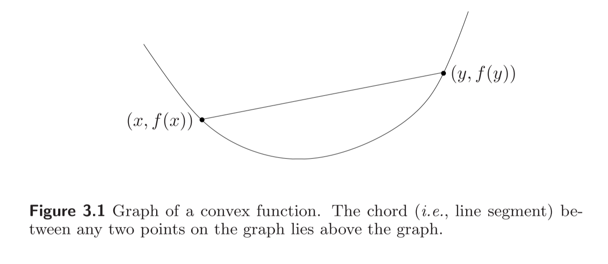
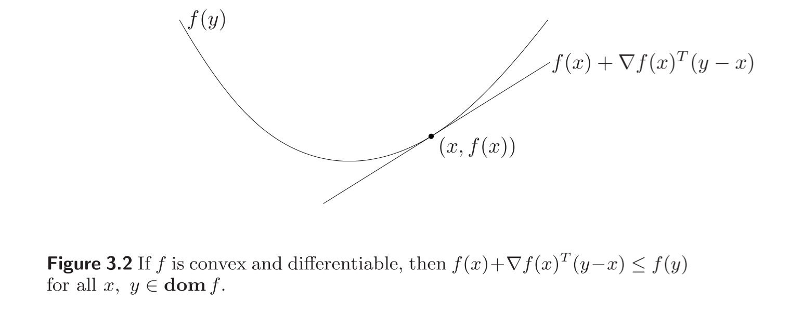
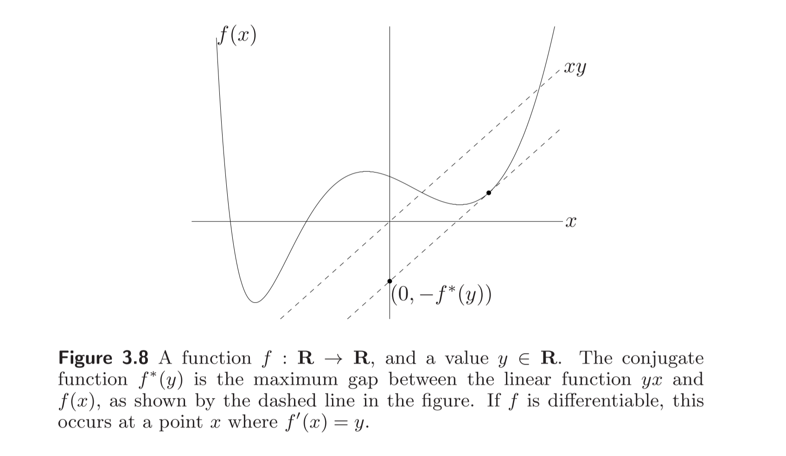

#! https://zhuanlan.zhihu.com/p/586163525
# [凸优化笔记02] Convex Function
In this section, we introduce four definations concerning the convex function

关于凸函数，最重要的是四个定义，需要熟记。

## 2.1 Defination_1

if **dom** $f$ is a convex set, and $0 \leq \theta \leq 1$, all $x,y\in \text{dom} f$:
$$f(\theta x+(1- \theta)y) \leq \theta f(x)+(1- \theta)f(y).$$

则函数$f$是凸函数(convex function)

如果把定义增强，则是严格凸(strictly convex)。if $0<\theta<1$ and $x \neq y$, and $f(\theta x+(1- \theta)y) < \theta f(x)+(1- \theta)f(y).$

>Note: 如果$-f$是凸函数，则$f$是凹函数（上述不等号取反方向）

凸函数示意图：

## 2.2 Defination_2

Extended-value extension（凸函数的扩展）拓展之后仍然是凸函数。

$\tilde{f}(x): R^{n} \rightarrow R\ \cup\  \left\{ \infty \right\}$

$$\tilde{f}(x)= \left\{ \begin{matrix} f(x)\quad x \in domf \\ \infty \quad x \notin domf. \\ \end{matrix} \right.$$

例：示性函数(Indicator function $\tilde{I}_{C}(x)$)是凸函数

$$\tilde{I}_{C}(x)= \left\{ \begin{matrix} 0 \quad x \in C \\ \infty \quad x \notin C. \\ \end{matrix} \right.$$

>Note: 如下函数不是凸函数。

$$J_{c} = \left\{ \begin{matrix} 1 \quad x \notin C \\ 0 \quad x \in C. \\ \end{matrix} \right.$$

## 2.3 Defination_3 (first-order conditions)

设$f:R^n\rightarrow R$可微，则函数$f$为凸 等价于：$dom f$ is convex and 

$$f(y)\geq f(x)+ \nabla f(x)^{T}(y-x)$$

如下图所示：

证明思路及注意事项：1）利用定义1。2）考虑一维情况，然后再考虑$n$维。3）因为是充要条件，所以正反两边都要证明。

## 2.4 Defination_4 (second-order conditions)

若函数$f$二阶可微，则函数$f$是凸函数 等价于：

$$ \nabla ^{2}f(x)\geq 0,$$

for all $x \in \text{dom}\ f$. 若海森矩阵大于0，则是严格凸(strictly convex)。

>note: 若定义域不是凸集，则该函数一定不是凸函数。

## 2.5 常见凸函数

### 1）二次函数

$$f(x) = \frac{1}{2} X^{T}PX + q^{T}X + R$$

### 2）幂函数 

$$f = e^{ax}, a\in R$$

### 3） 绝对值的幂函数

$$|x|^{p},\text{for}\ p \geq 1$$ 

### 4）对数函数

$$\text{log}\ x,\ x \in R_{++} $$

### 5）负熵（严格凸）

$$x\ \text{log}\ x,\ x \in R_{++}$$

### 6）范数

注意：零范数是非零元素的总和。零范数不是范数也不是凸函数。

### 7）极大值函数

$$f(x)=\text{max}\{x_1, x_2,\dots,x_n\}$$ 

### 8）Log-sum-up函数

$$f(x)=\text{log}(e^{x_1}+e^{x_2} + \dots + e^{x_n})$$

对于Log-sum-up函数，有如下性质：

$$ \max \left\{ x_{1}, \ldots ,x_{n}\right\} \leq f(x)\leq \max \left\{ x_{1}, \ldots ,x_{n}\right\} + \log n$$

### 9）Log-det 函数是凹函数(dom $f=S^{n}_{++}$)，X是矩阵

$$f(X)= \log detX$$

## 2.6 凸函数的保凸变换

### 1）非负加权和

函数$f_1,f_2,...,f_m$均为凸函数，则当$w_1,w_2,...,w_n \geq 0$时，如下函数也为凸

$$f=w_{1}f_{1}+ \cdots +w_{m}f_{m},$$

扩展：如果$f(x,y)$对于任意的$y\in A$是凸函数，且$w(y)\geq 0\ \text{for} \text{each}A$, 则如下函数也为凸函数：

$$g(x)= \int _{A}w(y)f(x,y)dy$$

### 2）仿射变换

$f:R^{n}\rightarrow R$, $A \in R^{n\times m}$, $b \in R^{n}$, 如果$f$函数是凸，则$g$函数也凸，如果$f$是凹，则$g$也是凹：

$$g(x)=f(Ax+b)$$

### 3）极大值函数

$$f(x)= \max \left\{ f_{1}(x),f_{2}(x)\right\} ,$$

where $domf=domf_{1}\cap domf_{2},$

### 4）向量中前$r$个最大元素和

$$f(x)= \sum _{i=1}^{r}x_{[i]}= \max \left\{ x_{i_{1}}+ \cdots +x_{i_{r}}|1 \leq i_{1}<i_{2}< \cdots <i_{r}\leq n \right\} ,$$

### 5）无限个凸函数的极大值

$$g(x)=\text{sup}\ f(x,y)$$

for each $y\in A$. 函数$g$是凸函数，定义域如下：

$$\text{dom}\ g= \left\{ x|(x,y)\in \text{dom}f\ \text{for all} y \in A,supf(x,y)< \infty \right\}.$$

### 6）函数组合 (Composition)

$h:R^{k} \rightarrow R$ and $g:R^{n} \rightarrow R^{k}$, $f = h\ \circ g: R^{n} \rightarrow R$, defined by

$$f(x)=h(g(x)), \quad \text{dom}\ f= \left\{ x \in \text{dom}\ g\ |\ g(x)\in \text{dom}\ h\ \right\} .$$

考虑$n=k=1$的情况，函数$f$的二阶导为

$$f^{\prime \prime}(x)=h^{\prime \prime}(g(x))g^{\prime}(x)^{2}+h^{\prime}(g(x))g^{\prime \prime}(x).$$

根据上式可以分析得出如下四条姐论：

+ 如果$h$凸（二阶导$\geq 0$），且不降（一阶导$\geq 0$），$g$为凸，则$f$是凸函数
+ 如果$h$凸（二阶导$\geq 0$），且不增（一阶导$\leq 0$），$g$为凹，则$f$是凸函数
+ 如果$h$凹（二阶导$\leq 0$），且不降（一阶导$\geq 0$），$g$为凹，则$f$是凹函数
+ 如果$h$凹（二阶导$\leq 0$），且不增（一阶导$\leq 0$），$g$为凸，则$f$是凹函数

例:若g(x)为凸函数，则$e^{g(x)}$也是凸函数

### 7）函数的透视 (perspective of a function)

function $f:R^{n}\rightarrow R$

the perspective of $f$ is $g: R^{n+1} \rightarrow R$

$$g = tf(\frac{x}{t}),\ \text{dom}\ g = \{(x,t) | \frac{x}{t} \in\ \text{dom}f,\ t>0\}$$

如果$f$是凸（凹）函数，则函数$g$也是凸（凹）。

## 2.7 the conjugate of the function (函数的共轭)

Defination: $f:R^{n}\rightarrow R$, and $f^{*}:R^{n}\rightarrow R $.

$$f^{*}(y)= \quad \mathop{sup}\limits_{x\in \text{dom}\ f} \quad(y^{T}x-f(x)),$$

下方的图片也很好的表示了函数的共轭是什么含义。找到直线$xy$和函数$f(x)$相切的点（如果$f(x)$可微）。

+ 如果$f(x)$ 可微，则$f^{*}(y)$对应的$x$一定是$f'(x)=y$的点。

+ $f^{*}(y)$关于$y$一定是凸的。

性质：

+ 若$f$非凸，则$f^{**} ≠ f$

+ 若$f$凸，且$f$为闭函数(对于任意的$\alpha$，函数小于$\alpha$的下水平集是闭集)，则$f^{**}=f$.

## 2.8 Quasiconvex functions (拟凸函数)

### 1) $\alpha$-sublevel set

若$f:R^{n} \rightarrow R$, 则其$\alpha$-sublevel set 为：

$$C_{\alpha} = \{x\in\ \text{dom}f\ |\ f(x)\leq \alpha \}$$

性质：

+ 若$f$为凸，则该函数的所有$\alpha$-sublevelset 也为凸
+ 但若函数的$\alpha$-sublevelset 都是凸，$f$不一定是凸

### 2) defination

函数$f:R^{n} \rightarrow R$, for $\forall \alpha \in R$ 

+ Quasi convex, if $S_\alpha=\{ x=\text{dom}\  f\ | f(x) \leq \alpha \}$ 为凸

+ Quasi cave, if $S'_\alpha=\{ x=\text{dom}\ f\ | f(x) \geq \alpha \}$ 为凸

+ Quasi linear, if $S''_\alpha=\{ x=\text{dom}\ f\ | f(x) = \alpha \}$ 为凸

>note: $y=e^{x}$是拟凸函数，也是拟凹函数，还是拟线性函数。

凸函数满足拟凸函数，但拟凸函数不一定就是凸函数（可能是凹）。

拟凸函数也称为单模态函数（**Unimodal Function**）可以考虑用梯度下降法求最优解。

举例：boyd书P97

### 3) basic properties （性质）

Jensen’s inequality for quasiconvex functions: A function f is quasiconvex if and only if domf is convex and for any $x,y \in domfand0 \leq \theta \leq 1,$

$$f(\theta x+(1- \theta)y)\leq \max \left\{ f(x),f(y)\right\} ,$$

利用一阶条件和二阶条件可以判断是否是拟凸函数

### 4) first-order conditions

（假设可微）函数$f$是拟凸函数，当且仅当$\text{dom}\ f$是凸，对于定义域内任意的$x,y$有

$$f(y)\leq f(x)\Rightarrow \nabla f(x)^{T}(y-x)\leq 0.$$

注意一下凸函数和拟凸函数一阶条件的区别。对于凸函数，一阶条件的驻点是全局最优，但是拟凸函数，对于偏导等于0的点，不一定是全局最优。

### 5) second-order conditions

（假设二阶可微）函数$f$是拟凸函数，当且仅当$\text{dom}\ f$是凸，且

$$y^{T}\nabla f(x)=0 \Rightarrow y^{T}\nabla ^{2}f(x)y \geq 0.$$

（海森矩阵正定）

