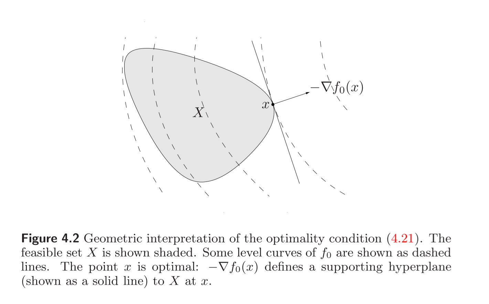
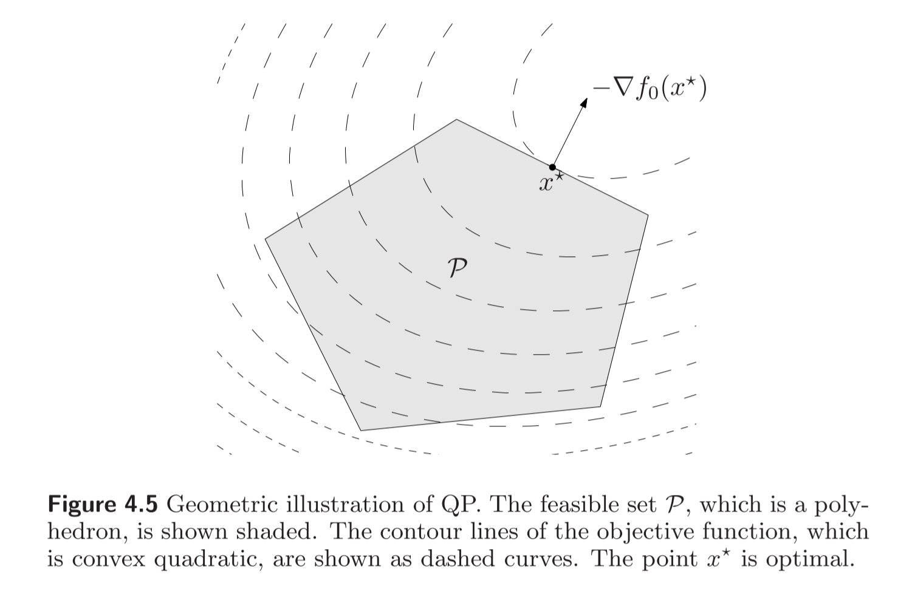
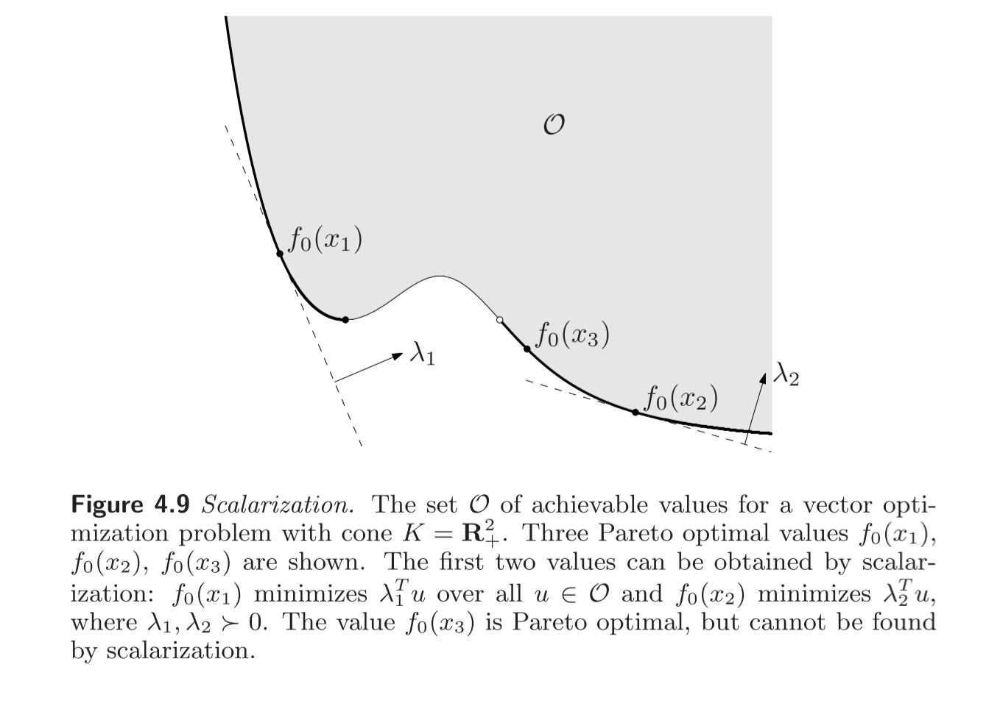

# [凸优化笔记03] convex problem 

广义：凸目标函数，凸约束

## 3.1 basic concepts

### 1. 一般问题的描述如下：

$$\begin{align} \min\ & f_{0}(x)\\ \text{subject to}\ & f_{i}(x)\leq 0,  i=1, \ldots ,m \\ & h_{i}(x)=0, i=1, \ldots ,p \\ \end{align}$$

+ optimization variables (优化变量): $x \in R^{n}$

+ objective function or cost function: $f_0:R^{n} \rightarrow R$

+ inequality constraint functions (不等式约束)：$f_i(x) \leq 0,\ f_i:R^n \rightarrow R$

+ equality constraints (等式约束):$h_i(x)=0, h_i:R^n \rightarrow R$

+ the domain of this optimization problem is:

$$D= \mathop{\bigcap}\limits_{i=0}^{m}\ \text{dom}\ f_{i}\cap \mathop{\bigcap}\limits_{i=1}^{p}\text{dom}\ h_{i},$$

+ feasible set (可行解集): $X_\text{f}$

+ optimal value $p^*$, 目标函数的最小值。

+ optimal point $x^*$，最优解。如果可行解存在，则$f_0(x^*)=p^*$

+ optimal set (最优解集): $X_{\text{opt}} = \{ x | x \in X_{\text{f}},\ f_0(x) = p*\}$

### 2. $\epsilon$-suboptimal set:

因为有时候我们不需要找到最优解，找到一个还可以的解(satisficing solution)即可。

A feasible point $x$ with: $f_{0}(x)\leq p^{*}+\epsilon$, where $\epsilon > 0$. 满足这一条件的集合为$\epsilon$-suboptimal set.

### 3. locally optimal solution (局部最优解):

$\exist R>0$使得下式成立

$$f_{0}(x)=\mathop{inf}\ \{ f_{0}(z)|f_{i}(z)\leq 0,i=1, \ldots ,m, \\ h_{i}(z)=0,i=1,.s,p,|z-x||_{2}\leq R \} ,$$

### 4. feasibility problems （可行性优化问题）

$$\begin{align}\text{find}\ & x \\ \text{subject to}\ & f_{i}(x)\leq 0, i=1, \ldots ,m \\ & h_{i}(x)=0, i=1, \ldots ,p. \\ \end{align}$$

>note: 为什么问题中的约束都是带等号的？因为所有的不带等号的问题可以转化为带等号的，求出来之后，检查是否是取等号即可，如果是，则无解。【相当于是约束条件松了一些】

### 5. equivalent problems

如果在标准形式基础上，目标函数与不等式约束，等式约束前面，乘一个系数。则该问题的最优解和原标准形式的解一致。这两个问题是等价的。

为什么需要乘上系数？消除实际建模时因为单位引起的差异。（有消除量纲的味道）

## 3.2 convex optimization problem

### 1. 定义

广义上的凸问题：目标函数是凸函数，约束的domain是凸集。

狭义上的凸问题，目标函数是凸函数，约束中的函数也必须是凸函数。

在boyd书中，讨论的都是狭义的凸问题。书中原话：

>For us, a convex optimization problem is not just one of minimizing a convex function over a convex set; it is also required that the feasible set be described specifically by a set of inequalities involving
convex functions, and a set of linear equality constraints.

凸问题有一个很好的性质：局部最优即是全局最优。

### 2. quasiconvex optimization

目标函数是拟凸函数的，则称该优化问题为拟凸优化问题。（不等式约束的函数为凸函数）

拟凸优化问题的局部最优解不是全局最优解。

### 3. complementarity (互补条件)

**An optimality criterion for differentiable $f_0$**

如果$f_0$可微，则对$\forall x,y \in \text{dom}\ f_0$下式一定满足：

$$f_{0}(y)\geq f_{0}(x)+ \nabla f_{0}(x)^{T}(y-x)$$

Let $X$ is feasible set:

$$X= \left\{ x|f_{i}(x)\leq 0,i=1, \ldots ,m,h_{i}(x)=0,i=1, \ldots ,p \right\} .$$

那么当$x^{*}$ is optimal 当且仅当：

$$ \nabla f_{0}(x^*)^{T}(y-x^*)\geq 0\ \text{for all}\ y \in X.$$

可从几何角度理解该不等式：两个向量夹角小于90°。$(y-x^*)$是最优解指向可行集内部点的矢量

考虑仅有不等式约束的优化问题：

$$\begin{align}\text{min}\ & f_0(x) \\
\text{subject to}\ & x \geq 0\end{align}$$

则最优解$x^*$满足以下条件：

$$\begin{align}x^* & \geq 0, \\
 \nabla f_{0}(x^*) & \geq 0, \\
 x^*_{i}(\nabla f_{0}(x^*))_{i} & =0,i=1, \ldots ,n.\end{align}$$

 最后一个条件为互补条件。

 **推理过程**

 根据可微函数的最优性，则$\forall y \in X$:

$$ \nabla f_{0}(x^*)^{T}(y-x^*)\geq 0$$

因为$y$是可行集内，所以$y \geq 0$, 又因为$y$是无上界的，所以第一项$\nabla f_{0}(x^*)^{T} y$中，如果$y$前面的导数项是负的，则最优性条件无法满足。所以$\nabla f_{0}(x^*)^{T} \geq 0$。这样仅考虑$-\nabla f_{0}(x^*)^{T}\ x^* \geq 0$，但是所有的$x$以及导数项都是≥0的，所以满足夹逼得这个内积必须是0，又因为每一项都是非负的，所以每一项都=0。

## 3.3 linear program problem

注意：linear program (线性规划), linear programming (解线性规划)

$$\begin{align} \min\ & c^{T}x+d \\ \text{subject to}\ & Gx = h \\ & Ax =b, \\ \end{align}$$

可行集如下图所示：

如何判断两个问题等价：

+ 两个问题的可行集可以相互映射

## 3.4 quadratic program problem （二次规划）

$$\begin{align} \min \quad & (1/2)x^{T}Px+q^{T}x+r \\ 
\text{subject to} \quad & Gx \leq h \\
& Ax = b\end{align}$$

如果其中的不等式约束是二次函数，则称为QCQP问题（二次约束二次规划问题）。

$$\begin{align} \min \quad & (1/2)x^{T}P_0x+q_0^{T}x+r_0 \\ 
\text{subject to} \quad &  (1/2)x^{T}P_ix+q_i^{T}x+r_i \leq 0,\ i=1,...,m \\
& Ax = b\end{align}$$

LASSO方法：如果目标函数中有0范数（非0元素个数）【x是稀疏的】，可以转换为1范数（绝对值）【L1−Regularized least squares】。如果是求极小值时，可以将$x$转为两个正数相减，转换为QP问题。

L2-Regularized least square(岭回归)

在目标函数中加入2范数的平方。

## 3.5 Multi-Objective Optimization Problem(MOP)

又称为vector optimization problem

$$\begin{align} \min \quad & f_{0}(x)\\\text{subject to}\quad & f_{i}(x)\leq 0, \quad i=1, ... ,m \\ & h_{i}(x)=0, \quad i=1,...,p. \\ \end{align}$$

$f_0:R^n \rightarrow R^q,\ f_i:R^n \rightarrow R,\ h_i:R^n \rightarrow R$

如果$\{f_0(x)\}$在$R^k$中为凸， $f(x)$为凸，$h_i(x)$为仿射函数，则必可通过下述方法求得Pareto front上一点。

$$\begin{align} \min \quad & \lambda ^{T}f_{0}(x)\\ \text{subject to} \quad &  f_{i}(x)\leq 0, i=1,...,m \\  & h_{i}(x)=0, i=1,...,p, \\ \end{align}$$

$\lambda$是权重。帕累托最优面不一定连续，如下图：

许多时候，需要将多目标函数转化为单目标函数的问题。