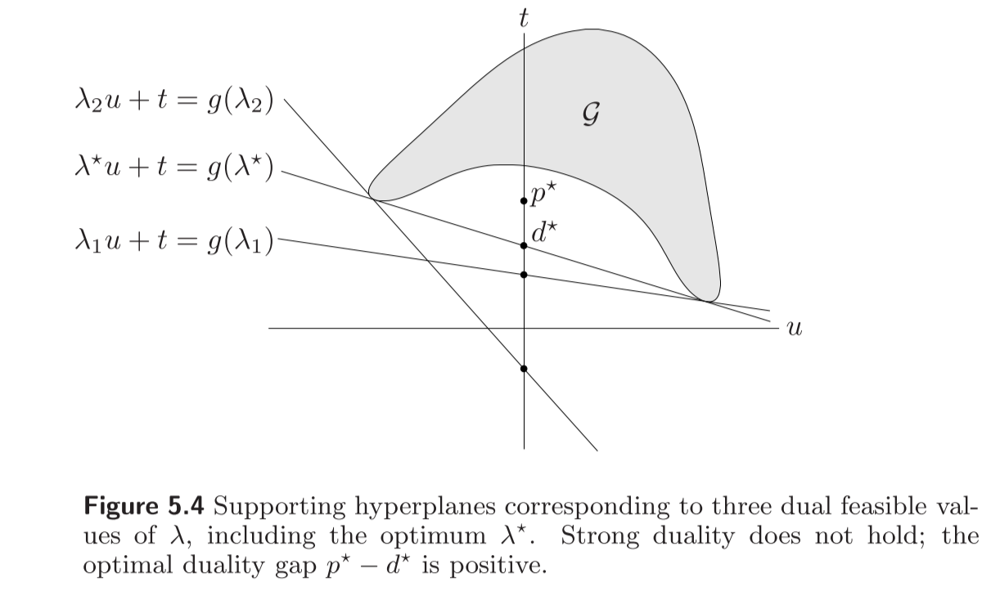
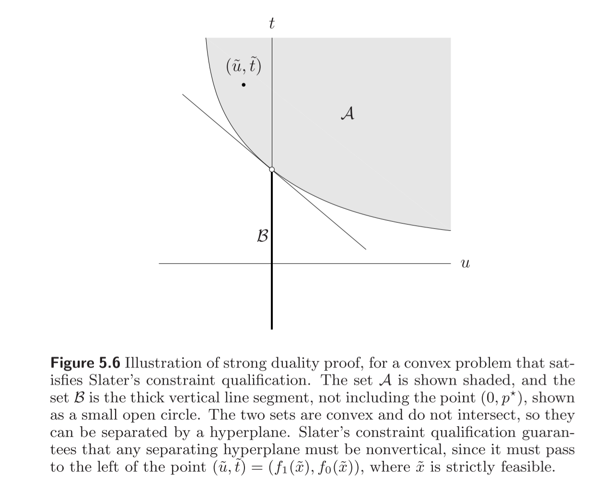

#! https://zhuanlan.zhihu.com/p/590749878
# [凸优化笔记04] duality

对偶是凸优化的精髓。

## 4.1 Lagrange dual function

考虑如下标准形式的问题：

$$\begin{align} \min\ & f_{0}(x)\\ \text{snbjeet to}\ & f_i(x)\leq 0, \quad i=1, \ldots ,m \\ & h_{i}(x)=0, \quad i=1,...,p,\\ \end{align}$$

with variable $x \in R^{n}$, 定义域为 $D = \bigcap_{i=0}^{m} \text{dom}\ f_i\ \cap\ \bigcap_{i=1}^{p}\ \text{dom}\ h_i $.

通过将约束以加权和的形式加入目标函数，定义Lagrangian function $L$ is:

$$L(x, \lambda ,\nu)=f_{0}(x)+ \sum _{i=1}^{m}\lambda _{i}f_{i}(x)+ \sum _{i=1}^{p}\nu _{i}h_{i}(x),$$

with $\text{dom}\ L = D \times R^{m}  \times R^{p}$. 其中，$\lambda_i$和$\nu_i$被称为Lagrange multiplier(拉格朗日乘子)。向量$\lambda$和$\nu$被称为对偶变量。

Lagrange Dual Function 定义：

$$g(\lambda , \nu)=\mathop{\text{inf}}\limits_{x\in D} \ L(x, \lambda , \nu)$$

拉格朗日对偶函数的性质：
1. 不管原问题是凸还是凹，对偶函数一定是凹函数
2. 对于任意的$\lambda \geq 0$, 任意的$\nu$,存在$g(\lambda, \nu) \leq p*$. $p*$是原问题的最优解。

共轭函数与对偶函数的关系:

回忆一下共轭函数$f*$的定义:
$$f^{*}(y)=\mathop{\text{sup}}\limits_{x \in \text{dom}f}(y^{T}x-f(x)).$$

考虑如下等式约束的优化问题:
$$\min f(x) \\ 
   \text{s.t.} x=0\\$$
则$g(\nu)=\text{inf}(f(x)+ \nu ^{T}x)=-\text{sup}((- \nu)^{T}x-f(x))=-f^{*}(- \nu).$

## 4.2 Lagrange dual problem
OK,我们可以知道拉格朗日对偶函数是小于等于原问题最优解的，那么这个下界的最大值是怎么获取的呢？考虑如下问题：
$$\begin{align*} \ \ \max\ & g(\lambda , \nu)\\ \text{subject to}\ & \lambda \geq 0. \\ \end{align*}$$

上述优化问题就是原问题(primal problem)的拉格朗日对偶问题(Lagrange dual problem)。

性质：
1. 对偶问题一定是凸问题【非常好的性质】。
2. 对偶问题的对偶不一定是原问题。
3. 弱对偶性（weak duality）：$d^* \leq p^*$
4. 强对偶性（strong duality）:$d^*=p^*$
5. 对偶间隙：$p^*-d^*$

若原问题有可行解，则weak duality一定存在。那么什么时候强对偶性存在呢？利用如下条件判断：

slater's condition: 当原问题（标准形式）是凸问题时！（这个是大前提，必须是凸问题），存在$x\in \text{relint}\ D$,使得$f_i(x)\leq 0, Ax=b$。$\text{relint}$代表将定义域取开集。

slater's condition是强对偶性的充分条件。

A weaker slater's condition:
1. 当不等式约束为仿射函数时，只要可行域非空，则必定有强对偶性存在。
2. 若目标函数为仿射时（线性规划问题），只要可行域非空，则必定有强对偶性存在。

强对偶性的两种解释：
1. 几何解释：书P233

2. 鞍点解释：在马鞍面上沿着两个方向求最优解结果一样。

## 4.3 Karush-Kuhn-Tucker (KKT) condition
非常重要的条件，后面介绍的所有算法都是围绕KKT条件进行求解的。

Assume:满足强对偶性，所有函数可微。

考虑如下原问题（P）：
$$\begin{align*}
   \min \ & f_0(x) \\
   \text{s.t.} \ & f_i(x) \leq 0, i = 1,2,...,m \\
    \ & h_i(x) = 0, i=1,2,...,p
  \end{align*}$$

则对偶问题（D）：
$$\begin{align*}
   \max \ & g(\lambda,\nu) \\
   \text{s.t.} \ & \lambda \geq 0
  \end{align*}$$

我们现在研究最优解$x^*,\lambda^*,\nu^*$具有什么样的性质？
1. 首先最优解一定是满足约束的。即：
   $$\begin{align*} \\
      f_i(x^*) \leq 0 \\
      h_i(x^*) = 0 \\
      \lambda^* \geq 0
   \end{align*}$$

2. 其次，由于假设强对偶性存在，因此对偶间隙为0。即：
   $$\begin{align*} \\
   f_0(x^*) & = g(x^*,\lambda^*) \\
            & = \mathop{\text{inf}}\limits_{x}\Big(f_0(x) + \sum_{i=1}^{m}\lambda^*_{i}f_i(x) + \sum_{i=1}^{p}v_i^*h_i(x)\Big) \\
            & = f_0(x^*) + \sum_{i=1}^m\lambda^*_if_i(x^*) + \sum_{i=1}^{p}v_i^*h_i(x^*) \\
   \end{align*}$$
   等式约束直接为0，消去。推出$\sum\lambda_i^*f_i(x^*)=0$，又由于$\lambda_i \geq 0$, $f_i(x^*)\leq 0$，因此推出每一项的乘积也必须为0。即$\lambda_i^*f_i(x^*)=0$。这就是互补松弛条件。
3. 由于lagrange function在$x^*$处取得最优解，则一定满足如下等式：
$$\frac{\partial L}{\partial x}\bigg|_ {x=x^*} = 0$$

**KKT条件**可以总结为：
$$\begin{align*} \\
   f_i(x^*) \leq & 0, (primal feasibility) \\
   h_i(x^*) = & 0, (primal feasibility) \\
   \lambda^* \geq & 0, (dual feasibility) \\
   \lambda_i^*f_i(x^*) = & 0, (complementary slackness)\\
   \frac{\partial L}{\partial x}\bigg|_ {x=x^*} = & 0, (stationarity)
  \end{align*}$$

命题：原问题为凸，各个函数可微，对偶间隙为0。与KKT条件为充要条件。同时，如果一个凸问题，如果能找到满足KKT条件的点，则该点一定是原问题和最优问题的最优解。

注意：原问题的等价问题的对偶问题不一定和原问题的对偶问题一致。例如,$\min f_0(x) = Ax+b$与$\min f_0(y), \text{s.t.}\ Ax+b=y$，等价，但是对偶问题不一样。
## 4.4 Sensitivity analysis
将标准形式的问题中的约束条件右侧从0改为一个常数。分析最优解的变化情况。如果右边的数$u(w)$是0，则表示和原问题一致。如果右边的数是正数，则约束变得松弛。如果右边的数是负数，则约束变紧了。
$$\begin{align*}\\
   \min \ & f_0(x) \\
   \text{s.t.} \ & f_i(x) \leq u_i, i=1,2,...,m \\
   & h_i(x) = w_i, i = 1,2,...,p
  \end{align*}$$
最优解记为$p^*(u,w)$，具有如下性质：
1. 若原问题为凸，则$p^*(u,w)$为$(u,w)$的凸函数。
2. 若原问题为凸，对偶间隙为0，$\lambda^*,\nu ^*$为原问题对偶最优解，则：
   $$p^*(u,w)\geq p^*(0,0)-\lambda^{*T}u-\nu^{*T}w$$
   敏感性分析：
   + 如果$\lambda_i^*$很大，且对第$i$个不等式约束加紧（取$u_i < 0$），那么最优值$p^*$会上升【性能下降】。
   + 如果$\nu_i^*$（正值）很大，取$w_i < 0$，或者$\nu_i^*$绝对值很大（负值），取$w_i > 0$，也会使得最优值上升【性能下降】。
   + 如果$\lambda_i^*$很小，那么就对第$i$个不等式放松（取$u_i>0$），最优值$p^*$不会下降的太多。
   + 如果$\nu_i^*$很小（正数），取$w_i>0$，或者$\nu_i^*$很小（负数），取$w_i<0$，那么最优值不会下降得太多。

3. 局部敏感性
若原问题为凸，对偶间隙为0，且$p^*(u,w)$在$(0,0)$处可微，则有
$$ \lambda _{i}^{*}=- \frac{\partial p^{*}(0,0)}{\partial u_{i}}, \quad \nu _{i}^{*}=- \frac{\partial p^{*}(0,0)}{\partial w_{i}}.$$