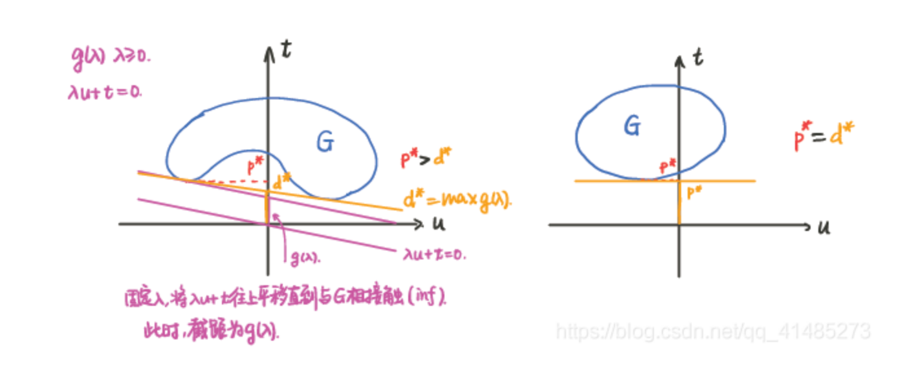

# [凸优化笔记04] duality

对偶是凸优化的精髓。

## 4.1 Lagrange dual function

考虑如下标准形式的问题：

$$\begin{align} \min\ & f_{0}(x)\\ \text{snbjeet to}\ & f_i(x)\leq 0, \quad i=1, \ldots ,m \\ & h_{i}(x)=0, \quad i=1,...,p,\\ \end{align}$$

with variable $x \in R^{n}$, 定义域为 $D = \bigcap_{i=0}^{m} \text{dom}\ f_i\ \cap\ \bigcap_{i=1}^{p}\ \text{dom}\ h_i $.

通过将约束以加权和的形式加入目标函数，定义Lagrangian function $L$ is:

$$L(x, \lambda ,\nu)=f_{0}(x)+ \sum _{i=1}^{m}\lambda _{i}f_{i}(x)+ \sum _{i=1}^{p}\nu _{i}h_{i}(x),$$

with $\text{dom}\ L = D \times R^{m}  \times R^{p}$. 其中，$\lambda_i$和$\nu_i$被称为Lagrange multiplier(拉格朗日乘子)。向量$\lambda$和$\nu$被称为对偶变量。

Lagrange Dual Function 定义：

$$g(\lambda , \nu)=\mathop{\text{inf}}\limits_{x\in D} \ L(x, \lambda , \nu)$$

拉格朗日对偶函数的性质：
1. 不管原问题是凸还是凹，对偶函数一定是凹函数
2. 对于任意的$\lambda \geq 0$, 任意的$\nu$,存在$g(\lambda, \nu) \leq p*$. $p*$是原问题的最优解。

共轭函数与对偶函数的关系:

回忆一下共轭函数$f*$的定义:
$$f^{*}(y)=\mathop{\text{sup}}\limits_{x \in \text{dom}f}(y^{T}x-f(x)).$$

考虑如下等式约束的优化问题:
$$\min f(x) \\ 
   \text{s.t.} x=0\\$$
则$g(\nu)=\text{inf}(f(x)+ \nu ^{T}x)=-\text{sup}((- \nu)^{T}x-f(x))=-f^{*}(- \nu).$

## 4.2 Lagrange dual problem
OK,我们可以知道拉格朗日对偶函数是小于等于原问题最优解的，那么这个下界的最大值是怎么获取的呢？考虑如下问题：
$$\begin{align*} \ \ \max\ & g(\lambda , \nu)\\ \text{subject to}\ & \lambda \geq 0. \\ \end{align*}$$

上述优化问题就是原问题(primal problem)的拉格朗日对偶问题(Lagrange dual problem)。

性质：
1. 对偶问题一定是凸问题【非常好的性质】。
2. 对偶问题的对偶不一定是原问题。
3. 弱对偶性（weak duality）：$d^* \leq p^*$
4. 强对偶性（strong duality）:$d^*=p^*$
5. 对偶间隙：$p^*-d^*$

若原问题有可行解，则weak duality一定存在。那么什么时候强对偶性存在呢？利用如下条件判断：

slater's condition: 当原问题（标准形式）是凸问题时！（这个是大前提，必须是凸问题），存在$x\in \text{relint}\ D$,使得$f_i(x)\leq 0, Ax=b$。$\text{relint}$代表将定义域取开集。

slater's condition是强对偶性的充分条件。

A weaker slater's condition:
1. 当不等式约束为仿射函数时，只要可行域非空，则必定有强对偶性存在。
2. 若目标函数为仿射时（线性规划问题），只要可行域非空，则必定有强对偶性存在。

强对偶性的两种解释：
1. 几何解释：可以看这个CSDN笔记里的图。[鞍点解释图](https://blog.csdn.net/qq_41485273/article/details/113934101)

2. 鞍点解释：在马鞍面上沿着两个方向求最优解结果一样。

## 4.3 Karush-Kuhn-Tucker (KKT) condition

## 4.4 Sensitivity analysis